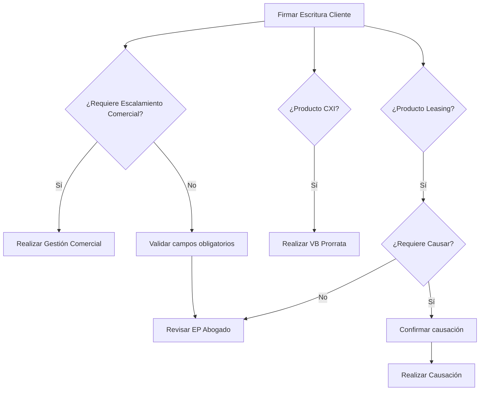

# BBV-86 — Firmar Escritura Cliente  
## Escrituración y Garantías

> Historia de usuario correspondiente a la actividad **Firmar Escritura Cliente** del proceso de legalización BBVA Colombia.

---

## 1. Información general

| Campo | Valor |
|---|---|
| **Código** | BBV-86 |
| **Título** | HU - Actividad Firmar Escritura Cliente (Escrituración y Garantías) |
| **Estado** | Tareas por hacer |
| **Proyecto** | BBVA - Colombia |
| **Tipo** | Historia |
| **Prioridad** | Media |
| **Informador** | Jorge Andres Garzon Paez |
| **Persona asignada** | Jorge Andres Garzon Paez |
| **Resolución** | Sin resolver |
| **Etiqueta** | BBVA_LEGALIZACION |
| **Épica principal** | Presto Escrituración y Garantías BBVA Legalización |

---

## 2. Descripción

### Yo como
Analista de Vivienda / Gestor Notaría.

### Deseo
Acceder a la pantalla en el acordeón **“Escrituración y Garantías”** para los créditos que requieren este trámite, registrar la confirmación de la firma de la escritura y definir el enrutamiento del trámite mediante los validadores de escalamiento comercial y las condiciones del producto CXI.

### Para
Continuar el flujo operativo hacia la revisión legal del abogado, escalar comercialmente cuando existan retenciones o habilitar los flujos paralelos de revisión para proyectos constructores —Prorrata— y Leasing —Causación—.

---

## 3. Alcance

La funcionalidad corresponde a la actividad transaccional inicial del subproceso de **Escrituración**.

Aplica única y exclusivamente a los productos de crédito que requieren escrituración.

La actividad funciona como una compuerta de enrutamiento múltiple que, basándose en campos de decisión manual y variables heredadas del producto —por ejemplo, si es CXI o requiere causar—, dispara el flujo hacia:

- Abogado.
- Comercial.
- Gestor Constructor.
- Analista de Leasing.

---

# 4. Criterios de aceptación y reglas de negocio

## CA01 — Criterio global transversal

1. El sistema debe renderizar y mantener la estructura visual de los grupos de datos —pestañas o acordeones— exactamente igual a la actividad anterior.

2. El sistema debe mostrar en la parte superior una sección fija denominada **Información General**.

   **Regla de visualización:**  
   La sección será estrictamente de solo lectura y mostrará los datos más recientes y actualizados.

3. El sistema debe incorporar un contenedor para las **Funciones Transversales**, dividido en:

   - **Expediente Digital:** permite la carga, visualización y verificación de documentos.
   - **Trazabilidad / Bitácora:** muestra el historial completo de acciones.
   - **Carta de aprobación automática:** permite generar automáticamente una nueva carta de aprobación con los datos establecidos.

4. La pantalla debe disponer de opciones claras para:

   - Guardar.
   - Transicionar / Avanzar.

5. Al ejecutar una transición con el botón **Avanzar**, se debe registrar en la bitácora:

   - Fecha.
   - Actividad: `Firmar Escritura Cliente`.
   - Usuario ejecutor.
   - Decisiones de enrutamiento.
   - Observaciones.

---

## CA02 — Filtro por tipo de crédito y acordeón

El sistema debe desplegar obligatoriamente el grupo de datos denominado:

> **Firmar Escrituración Cliente**

La actividad y su interfaz se habilitarán exclusivamente para solicitudes que, en etapas previas, determinaron que **sí requieren escrituración**.

### Tipos de crédito que requieren escrituración

- Constructor individual.
- Hipotecario Nuevo.
- Hipotecario Usado.
- Hipotecario CXI.
- Leaseback Habitacional.
- Leasing Nuevo.
- Leasing Usado.
- Leasing CXI.
- Remodelación para Ampliar / Hipotecar.

---

## CA03 — Campo de decisión y enrutamiento principal

Dentro del acordeón debe existir un campo de selección denominado:

> **¿Requiere Escalamiento Comercial?**

### Opción “Sí”

Cuando se selecciona **Sí** y se acciona **Avanzar**:

- El flujo debe ingresar directamente a la actividad **Realizar Gestión Comercial**.
- La tarea debe asignarse al rol **Comercial**.

### Opción “No”

Cuando se selecciona **No**:

- El sistema debe exigir el diligenciamiento de los demás campos operativos obligatorios de la pantalla.
- Al accionar **Avanzar**, el flujo debe transitar hacia la actividad **Revisar EP Abogado**.
- La tarea debe asignarse al rol **Abogado**.
- En este escenario no se gestiona un CXI.

---

## CA04 — Regla para productos CXI y Leasing

Al avanzar, el sistema debe evaluar internamente las variables heredadas del tipo de crédito.

### Crédito CXI

Cuando el crédito es un **CXI —Crédito Constructor Individual—**, el sistema debe habilitar y disparar en paralelo la actividad:

> **Realizar VB Prorrata**

La actividad debe quedar a cargo del **Gestor Constructor**, dentro del subproceso de Gestión CXI / Causar.

Aplica para:

- Hipotecario CXI.
- Leasing CXI.

### Crédito Leasing

Cuando el crédito es Leasing, el sistema debe mostrar el campo:

> **¿Requiere Causar?**

Si se selecciona **Sí**, el sistema debe habilitar y disparar el subproceso **Gestión CXI - Causar**, dentro del subproceso **Gestión Leasing**, ingresando específicamente a la actividad:

> **Realizar Causación**

La actividad debe quedar a cargo del **Analista de Leasing**.

Si requiere causar, debe mostrarse un mensaje modal de alerta con la siguiente validación:

> ¿Estás seguro que requieres realizar causación?

- Si el usuario selecciona **Sí**, avanza a Gestión Leasing.
- Si el usuario selecciona **No**, se cierra el mensaje de alerta.

Aplica para:

- Leasing Nuevo.
- Leasing Usado.
- Leasing CXI.

### Regla adicional

La actividad **Revisar EP Abogado** debe asignarse siempre al rol **Abogado**.

---

## CA05 — Exclusión de flujo

Todo trámite que **no requiera escrituración** debe omitir automáticamente esta pantalla y su subproceso, siguiendo la ruta definida por la arquitectura del modelo principal.

---

## CA06 — Obligatoriedad condicionada

Los campos técnicos requeridos para que el Abogado pueda revisar la Escritura Pública serán obligatorios únicamente cuando el Analista de Vivienda / Notaría determine que **no hay escalamiento comercial**.

Cuando existe escalamiento comercial, la prioridad es enviar el caso a dicha área.

---

## CA07 — Bloque “Información de Notaría” — Herencia editable

El sistema debe desplegar un bloque específico que herede y precargue la información registrada en la actividad previa:

> **Validar Cumplimiento de Políticas**

La información heredada será editable para asegurar su corrección.

### Campos editables

- Notaría, alineada con Ciudad Notaría en base de datos.
- Fecha Notaría.
- Número Notaría.

---

## CA08 — Bloque “Formalización de Escritura” — Captura

El sistema debe desplegar un bloque con campos obligatorios en blanco para que el analista diligencie los datos del documento firmado.

Estos datos son necesarios para futuras etapas como:

- VoBo Prorratas.
- Recepción Boleta.

### Campos

- Número de la escritura.
- Fecha de la escritura.

---

## CA09 — Multienrutamiento transparente

La habilitación de las actividades:

- **Realizar VB Prorrata**.
- **Realizar Causación**.

Debe ejecutarse automáticamente en backend, validando las condiciones CXI y CA04.

El usuario actual:

- Hereda la marca del producto.
- Selecciona si requiere causar, cuando aplica.
- Dispara automáticamente las actividades al avanzar.

---

## CA10 — Condicionalidad de captura

Cuando el analista selecciona **Sí** en:

> ¿Requiere Escalamiento Comercial?

El sistema debe eximir la obligatoriedad de los siguientes campos:

- Número firma de la escritura.
- Fecha de la escritura.

Se asume que la firma aún no se ha concretado.

Cuando se selecciona **No**, estos campos son estrictamente obligatorios para poder avanzar.

---

## CA11 — Restricción de escalamiento por concepto

El sistema debe identificar si existe un retorno desde alguna parte del flujo y si previamente se avanzó buscando el resultado de concepto.

La finalidad es evitar volver a escalar al área correspondiente, incluyendo:

- Leasing Causar.
- Revisar EP Abogado.
- VoBo Prorratas.

---

## CA12 — Funcionalidad de registro de contacto

### Formulario modal

Debe habilitarse un botón **Agregar** que despliegue un modal con los siguientes campos:

| Campo | Regla |
|---|---|
| **Nro. Contacto** | Autogenerado secuencial |
| **Fecha Contacto** | Por defecto, fecha actual; formato `DD/MM/AAAA` |
| **Resultado de Contacto** | Lista desplegable `L8 - Resultado de Contacto` |
| **Detalle** | Lista dependiente del resultado `L9 - Detalle` |
| **¿Inmueble definido?** | Valores `Sí / No` |
| **Área contactada** | Notaría, Constructora o Cliente |
| **Observaciones** | Texto libre |

### Histórico

Al seleccionar **Guardar**, la información debe registrarse en una tabla histórica tipo Grid visible en la misma sección.

Los registros deben mostrarse en orden cronológico descendente.

---

# 5. Modelado de datos

## 5.1 Datos de notaría

> Datos precargados, pero modificables.

| Campo | Tipo de dato | Editable | Obligatorio | Regla de negocio / Origen |
|---|---|---:|---:|---|
| **Notaría** | Alfanumérico | Sí | Sí | Heredado de `Validar Cumplimiento de Políticas` |
| **Número Notaría** | Numérico | Sí | Sí | Heredado de `Validar Cumplimiento de Políticas` |
| **Ciudad Notaría** | Alfanumérico | Sí | Sí | Heredado de `Validar Cumplimiento de Políticas` |

---

## 5.2 Datos de escritura

| Campo | Tipo de dato | Editable | Obligatorio | Regla de negocio / Origen |
|---|---|---:|---:|---|
| **Número de la escritura** | Alfanumérico | Sí | Condicionado | En blanco; obligatorio cuando no hay escalamiento comercial |
| **Fecha de la escritura** | Fecha | Sí | Condicionado | En blanco; obligatorio cuando no hay escalamiento comercial |
| **Representante Legal** | Alfanumérico | Sí | No | En blanco; parametriza `L38` |
| **¿Requiere Escalamiento Comercial?** | Lista Sí/No | Sí | Sí | Compuerta; si es Sí, avanza a `Realizar Gestión Comercial` |
| **Tipologías** | Lista | Sí | Sí | Dependiente de que `¿Requiere Escalamiento Comercial? = Sí` |
| **¿Requiere Causar?** | Booleano | Sí | Sí | Sí habilita Gestión Leasing para `Realizar Causación`; No omite el escalamiento |
| **Observaciones** | Texto / Área | Sí | No | Campo libre para notas de la cita o firma |

---

# 6. Reglas de enrutamiento resumidas



---

# 7. Validaciones funcionales para implementación

## Validación de campos obligatorios

```text
SI requiereEscalamientoComercial = "SI"
    numeroEscritura = opcional
    fechaEscritura = opcional
    destino = "Realizar Gestión Comercial"
SINO
    numeroEscritura = obligatorio
    fechaEscritura = obligatorio
    destino = "Revisar EP Abogado"
FIN
```

## Validación CXI

```text
SI productoEsCXI = true
    dispararEnParalelo("Realizar VB Prorrata")
FIN
```

## Validación Leasing

```text
SI productoEsLeasing = true Y requiereCausar = true
    mostrarConfirmacion("¿Estás seguro que requieres realizar causación?")
    SI confirmacion = true
        dispararEnParalelo("Realizar Causación")
    FIN
FIN
```

---

# 8. Consideraciones para Kiro

- Mantener nombres de actividades exactamente como aparecen en la historia de usuario.
- Separar las reglas de visualización de las reglas de negocio.
- Implementar las transiciones como reglas configurables.
- Registrar toda transición en la bitácora.
- Evitar duplicar escalamiento cuando el flujo retorna desde actividades posteriores.
- Validar en backend las condiciones CXI y Leasing, aunque la interfaz oculte o muestre campos dinámicamente.
- Tratar los campos de escritura como obligatorios condicionados.
- Conservar trazabilidad de todas las decisiones de enrutamiento.
